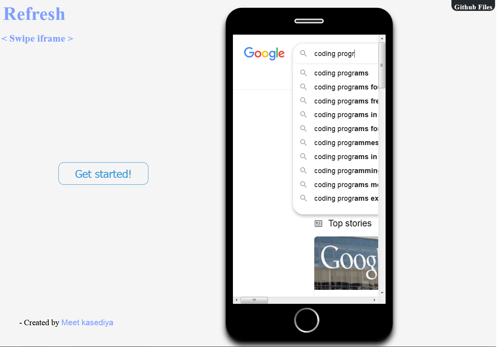

# Playing-with-Device-looks.
The idea is to recreate the simple home navigation but in a different way!
 
 

  
PREVIEW
 

  

 

### Prerequisites

* a code editor - (Sublime, atom, etc.)
* Understanding of HTML & CSS

## Running the tests

Open 'Mobile.html' in any browser of your choice 
Enjoy! :)

## 🛠️ Built With

* [Sublime] - For editing

## Authors

* **Meet kasediya** *

Linkedin - https://www.linkedin.com/in/meet-kasediya-6308031ab/ 🔗 
codepen -  https://codepen.io/Meet_kasediya 🔗

 
## Video credits:

* iPhone 11 Pro(Youtube):-

Watch now: https://www.youtube.com/watch?v=cVEemOmHw9Y 🔗 
Learn more at https://apple.co/2m5FP8w 🔗

* iPhone SE(Youtube)

Watch now: https://www.youtube.com/watch?v=SQIbeAk-bFA 🔗 
Learn more at https://www.apple.com/iphone-SE 🔗
